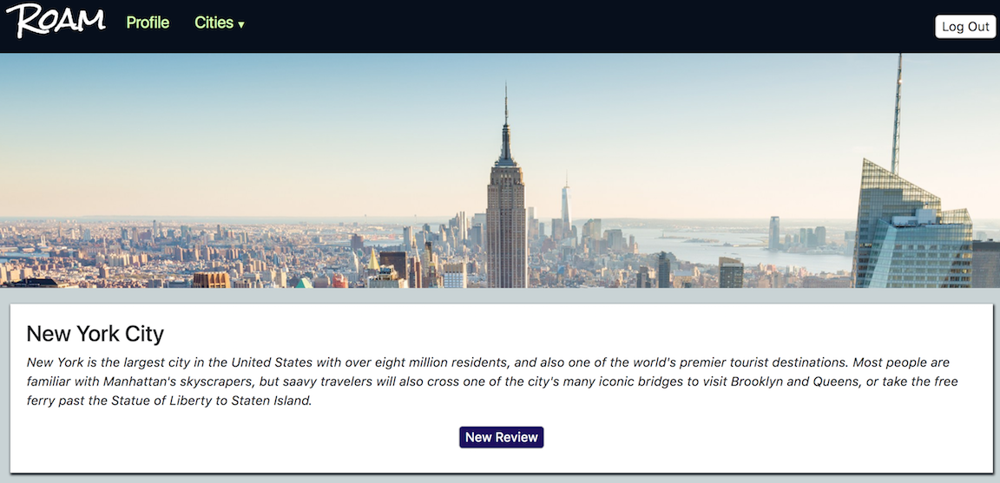

# Roam

Roam is a city review site for travelers made with Node.js, Express, PostgreSQL and EJS. Users can sign up, create a profile, and review cities on the site.



## Getting Started

To get a development copy running on your local machine, read below!

### Prerequisites

You will need to have Node, Node Package Manager, and PostgreSQL installed.

### Installing

Fork and clone this repository. After moving into the folder your repository was cloned to, ```npm install``` to get all required packages.

Next, you will need to set up your database with the following scripts: __create:db__, __load:db__, __load:session__, and __seed:db__. The load:sesson command is used to set up a table inside of node_modules that connect-pg-simple uses to store sessions in the database. If you wish to set up your own database to use with express-session, you can modify this step.

Before running, you will need to create your own .env file and provide your own properties for DATABASE_URL and SESSION_SECRET. If you are unsure of how to do this, check out the dotenv docs: https://www.npmjs.com/package/dotenv

Finally, run ```npm start``` to start the server, or ```npm run start:dev``` to run the server with nodemon.

## Deployment

This project is set up to deploy to a live system.

## Author
* **James McCormack** - *Initial work* -
[Framinus](https://github.com/Framinus)

## License

This project is licensed under the MIT License.

## Acknowledgments

- The folks at Learners Guild who answered my questions and provided support.
- My partner Joe, who was my perfect non-coding test user.
